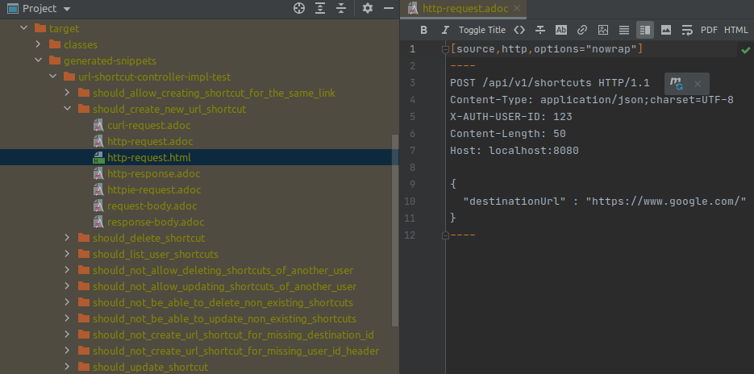
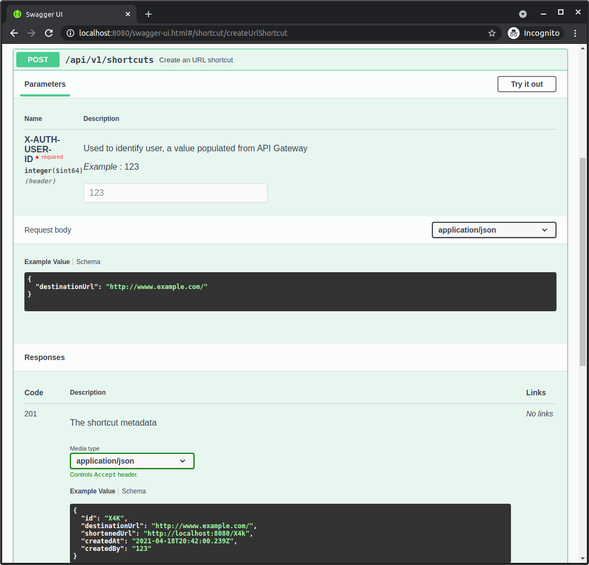

# URL Shortener demo Spring Boot App

URL shortener application allowing users to generate short URLs for any URL.

Rules and assumptions:
- URL Shortcuts can be created by any user
- URL Shortcut hashes are server generated and must be as short as possible (just like YouTube `v` parameters, example: https://www.youtube.com/watch?v=dQw4w9WgXcQ)
- URL Shortcuts are associated to a user account
- There is no way for the user to overwrite or customize URLs (only random hashes are supported)
- URL Shortcuts can only be edited or modified by user who created them
- If the same destination URL will be submitted multiple times, it will result in multiple shortcuts being created
  (there will be no "reuse" of previous URL Shortcut entries)
- User account is identified by `User ID`, it is assumed that:
  - The service is exposes behind an API Gateway
  - API Gateway handles user authentication and passes plain text `X-AUTH-USER-ID` header
  - The service verifies the presence of `X-AUTH-USER-ID` but does no extra validation of the value
  - The service does not manage user accounts, only loosely stores references
- Shortcuts are identified by `Text IDs`
- `Text IDs` must be as short as possible (hence the name ***URL shortener***)
- The service must be scalable, can be deployed as multiple instances

### The generation of sequential text IDs

The custom [`HashidsSequenceGenerator`]() implementation uses a combination of a **database sequence of longs**
and **number to text mapping**, the later is implemented by using a popular Hashids library.

The generator definition: https://github.com/piotrpolak/url-shortener/blob/master/src/main/java/ro/polak/urlshortener/support/HashidsSequenceGenerator.java
The generator usage: https://github.com/piotrpolak/url-shortener/blob/master/src/main/java/ro/polak/urlshortener/domain/model/UrlShortcut.java#L30

The biggest advantage of the Hashids library over a handwritten mapping algorithm is that it allows adding **salt**
to the **number to text mapping** thus making it hard to reverse engineer and makes it practically impossible
to guess the next text ID in the sequence.

This solution:
- allows generating text IDs in a single call to the database (a single repository save)
- scales up well and makes it possible to use all the benefits of the **database sequence of longs**:
  - high performance systems might tune up the `increment_size` of the sequence (see https://www.baeldung.com/hi-lo-algorithm-hibernate)
  - all the instances of the URL shortener microservice use the same database sequence and don't need to worry about **ID conflicts**
- makes it really hard to reverse engineer and guess the next text id in the sequence (mentioned above)

**Salt MUST NOT be changed throughout the lifecycle of the application as it will mess up with the previously stored IDs.**
  
## Technical aspects

The project is intended to be developer friendly, highly testable and aligned with the **API First principle**.

Individual technical features are listed below:

- The application:
  - Is intended to be deployed as a stateless microservice
  - Respect the REST best practices
  - Is built around SpringMVC, Spring Data together CRUD Repositories for data access to avoid verbose JPQL/SQL queries
  - Does input validation using JSR annotation based validator (Hibernate Validators)
- The application architecture:
  - Is written using hexagonal architecture, the business logic is separated from the adapters (HTTP glue code)
  - Adapter classes are intentionally **package scoped** and can't be imported by business logic classes
  - Model/DTO mapping is done using handwritten mappers for sake of simplicity
  - Controller interfaces and DTOs are generated based on the OpenAPI 3.0 definitions (API First)
- Database:
  - Schema is generated upon application startup based on the model description (no migration scripts are used)
  - PostgreSQL database is used in tests and in the Docker compose setup to reflect realistic database behavior
  - JPA Auditing is used to populate auditing fields
- Tests:
  - Are executed from the HTTP level
  - Use H2 in-memory database

## Testing

The application is tested using integration tests against a running application and a real database.

Integration tests are written using MockMVC and:
- test and ensure the API contract is stable over time
- provide high test coverage (including the ***infrastructure glue code***)

Test scenarios can be found at https://github.com/piotrpolak/url-shortener/blob/master/src/test/java/ro/polak/urlshortener/adapter/api/UrlShortcutControllerImplTest.java

RestDocs are used to generate code snippets with request/response payloads. These can be found in `target/generated-snippets`.



## Building the project

Building the project, integration tests executed against H2 in-memory database (fast)
```bash
mvn clean install
```

## Running the project locally

Running the project locally (H2 in-memory database)

```bash
pushd url-shortener-app && mvn spring-boot:run; popd
```

Running the project locally (H2 in-memory database + SwaggerUI)
```bash
pushd url-shortener-app && mvn spring-boot:run -PswaggerUI; popd
```
Swagger file: http://localhost:8080/swagger.yml
Swagger UI can be accessed at: http://localhost:8080/swagger-ui.html




## API First approach and OpenAPI generator

The DTOs and controller interfaces are generated out of the `swagger.yml` definition by using
https://github.com/OpenAPITools/openapi-generator tool.

More on the API First approach can be found at https://www.polak.ro/2021/04/02/api-first-and-code-generation-done-right.html

## Potential improvements
- Development Docker Compose setup allowing to run the app against a real database
- Test containers in test to simulate a real database
- Extended input validation using additional JSR annotations
- Extended error handler and improved error messages (for now the app uses the HTTP codes mostly)
- Automatic code formatting at the build time